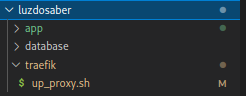

# Subindo serviço de Proxy Reverso


O Serviço ja vem pronto, voce apenas precisará editar colocando as informações de seu dominio no script up_proxy.sh dá permissão de execução e executar.

Arquivos se encontra em:




```
vim up_proxy.sh

```

Em seguida editar os seguintes campos
```
export EMAIL=email referente ao seu diminio

export DOMAIN=proxy.seudominio.cm

export USERNAME=admin

export PASSWORD=sua-senha
```
Dá permissão de execução
```
chmod +x up_proxy.sh
```
executar
```
./up_proxy.sh 
```