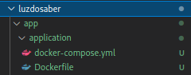

# Subindo serviço application 

**Para iniciar precisaremos de 3 passos**
- **Clonar o projeto**
- **Dos arquivos Dockerfile e docker-compose.yml e env**
- **Fazer o build da imagem**
- **Fazer o deploy do serviço**

Os Arquivos Dockerfile e docker-compose estão em:



Primeiro clonar o projeto
```
git clone https://github.com/lmedesenvolvimento/luz-do-saber-application.git

```

Copiar os arquivos Dockerfile e docker-compose e env para o mesmo nível do repositório clonado.

editar o nome e as informações do arquivo env e o arquivo database.yml

```
mv env .env

vim .env

cp config/database_master.yml config/database.yml
```
Fazer o build da imagem:

```
docker build -t luzdosaber-application:v1
```


Em seguida vamos iniciar o serviço do aplication.
```
docker stack deploy -c docker-compose.yml application
```

