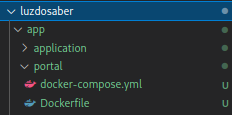

# Subindo serviço portal 

**Para iniciar precisaremos de 3 passos**
- **Clonar o projeto**
- **Dos arquivos Dockerfile e docker-compose.yml e env**
- **Fazer o build da imagem**
- **Fazer o deploy do serviço**

Os Arquivos Dockerfile e docker-compose estão em:



Primeiro clonar o projeto
```
git clone https://github.com/lmedesenvolvimento/luz-do-saber-portal.git

```

Copiar os arquivos Dockerfile e docker-compose e env para o mesmo nível do repositório clonado.

editar o nome do arquivo .env-cmdrc.example e colocar a url do application no arquivo em webserver/.env.example

```
cp .env-cmdrc.example .env-cmdrc


cp webserver/.env.example webserver/.env
```
Fazer o build da imagem:

```
docker build -t luzdosaber-portal:v1 .
```


Em seguida vamos iniciar o serviço do aplication.
```
docker stack deploy -c docker-compose.yml portal
```

