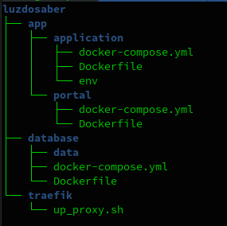
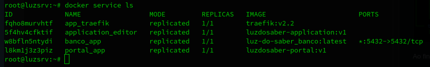
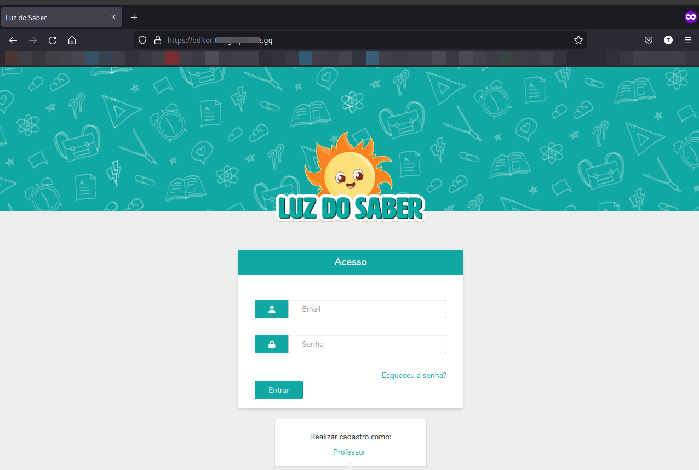
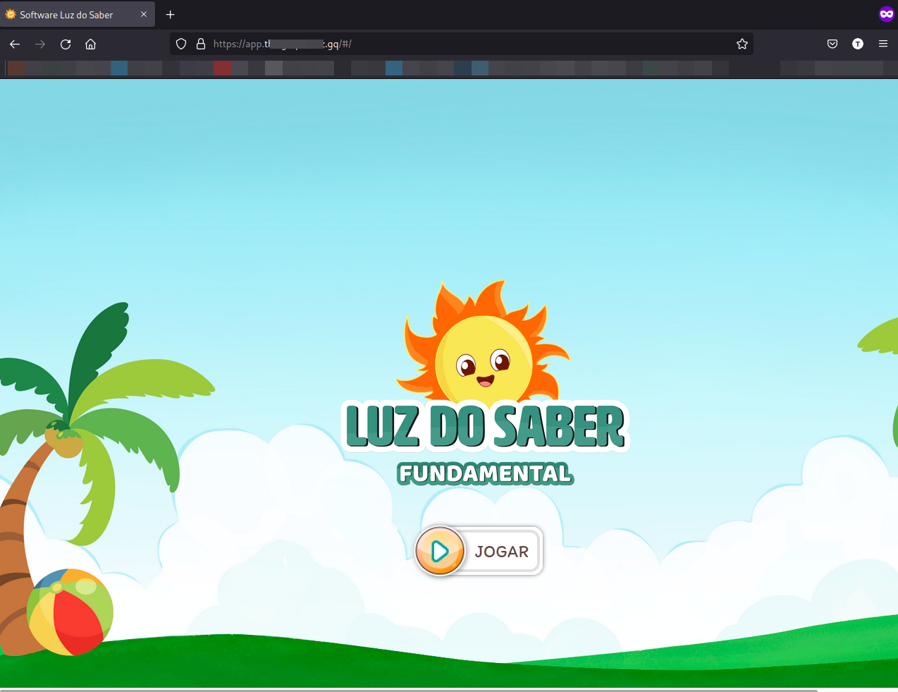

# Luz do Saber

Do ponto de vista pedagógico, o Luz do Saber é um aplicativo voltado para alfabetização e letramento que congrega diversas estratégicas pedagógicas, métodos e metodologias de ensino e aprendizagem. Tem sua estrutura fundada na rotina da sala de aula, levando em consideração momentos basilares fundamentais nos quais são trabalhados a predição, gêneros textuais, fluência leitura, análise linguística, letramento e alfabetização.

Do ponto de vista das tecnologias educacionais, o Luz do Saber é um ambiente virtual de aprendizagem com autoração de conteúdos on-line, no qual é possível sequenciar diversas atividades, jogos e aplicativos, incorporando objetos de aprendizagem para a disponibilização de conteúdos de diversas áreas.

Do ponto de vista computacional, trata-se de um software educacional composto por dois módulos: O primeiro de configuração, inclusão de usuários e turmas, autoração de conteúdos e mídias digitais e o segundo é uma interface adaptada utilizando estratégia de interação humano-computador para crianças do 1º ao 5º ano do ensino fundamental desenvolvida com os frameworks Ruby on Rails no back-end ),  Vue para o front-end e o bando de dados PostgreeSQL.

## Sumário 

1. [História]()
2. [Agradecimentos]()
3. [Licença de uso GNU/GLP3]()
4. [Guia do usuário](https://github.com/desenvolvedorabc/luzdosaber/blob/main/Guia%20do%20Usu%C3%A1rio/reademe.md)
5. [Guia para manuteção de infraestrutura]()
6. [Criando e instalando uma nova instância do Luz do Saber](https://github.com/desenvolvedorabc/luzdosaber#criando-e-instalando-uma-nova-inst%C3%A2ncia-do-luz-do-saber) 

## História

Atualmente, o Luz do Saber é um projeto do Programa Cientista-Chefe em Educação Básica do Estado do Ceará, gerido e financiado pela FUNCAP, que tem por objetivo colaborar com a aprendizagem e o desenvolvimento das crianças dos anos iniciais do Ensino Fundamental nos processos de oralidade, leitura e escrita a partir do contato com os diversos gêneros orais, escritos e digitais. Para tanto, disponibiliza um portal educacional gratuito com atividades online, jogos e aplicações voltadas para o desenvolvimento da escrita. Além disso, disponibiliza para download livros didáticos para o 1º e 2º anos do Ensino Fundamental e materiais para orientações didáticas aos professores. Também é disponibilizado uma grande biblioteca de livros da coleção PAIC – Prosa e Poesia.

As atividades propostas, tanto no material didático quanto no software, estimulam uma aprendizagem significativa e desafiadora. Estão organizadas em uma sequência didática que considera o processo de alfabetização na perspectiva do letramento e promove a interação a partir de situações reais de aprendizagem e do uso social da língua em congruência com a BNCC.

Luz do Saber Fundamental é um software que tem por objetivo colaborar com a aprendizagem e o desenvolvimento das crianças dos anos iniciais do Ensino Fundamental nos processos de oralidade, leitura e escrita a partir do contato com os diversos gêneros orais, escritos e digitais.

O projeto do Saber Infantil visa contribuir com o processo de alfabetização e letramento a partir de estratégias pedagógicas que favorecem o desenvolvimento da leitura e da escrita, além da inserção na cultura digital.

## Agradecimentos

    Em construção ....

## Licença de Uso

    Em construção ...

    [Saiba mais sobre a GPLv3](https://www.gnu.org/licenses/quick-guide-gplv3.html)

## Criando e instalando uma nova instância do Luz do Saber

Repositorio para criação de instância da aplicação luz do saber. 

Neste exemplo foi usado um dominio gratuito, e são necessárias um breve conhecimento sobre os seguintes assuntos: dominios, docker, aws, linux e banco de dados.

Foram criados arquivos .md numerados para seguir uma sequencia lógica. os arquivos que não estão nos repositorios das aplicações estão na pasta luzdosaber:

Ao final, queremos chegar ao objetivo de todos os serviços rodando:

